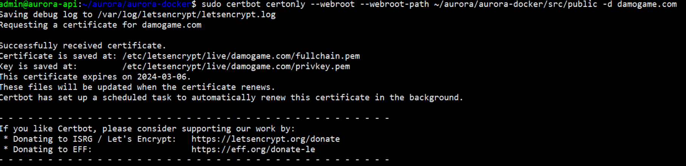
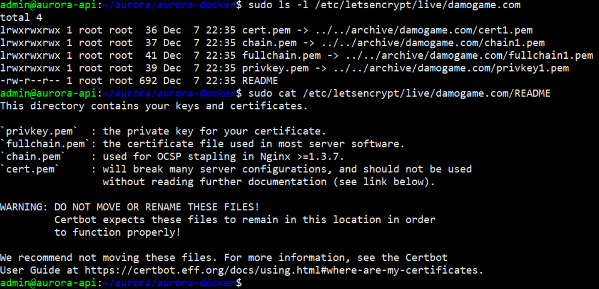

# Configuración VPS

| :date: _Revisión_: 12 de noviembre de 2024|
| -------- |

## Introducción
Este documento describe los pasos necesarios para configurar un servidor VPS con los certificados TLS/SSL de Let's Encrypt.

**Contenido**

1. [Instalación](#instalación)
2. [Renovación de certificados](#renovación-de-certificados)

## Instalación

> :label: **_Nota:_**: Esta parte sigue el [Tutorial para configurar HTTPS en Nginx](https://macdonaldchika.medium.com/how-to-install-tls-ssl-on-docker-nginx-container-with-lets-encrypt-5bd3bad1fd48)

### Paso 1: Instalar Certbot

```bash
$ sudo apt-get update
$ sudo apt-get install certbot python3-certbot-nginx
```

### Paso 2: Descargar los certificados TLS/SSL de Let’s Encrypt

Ubicado en `~/aurora/aurora-docker`, ejecutar:

```bash
$ sudo certbot certonly --webroot --webroot-path ~/aurora/aurora-docker/src/public -d damogame.com
```


Los certificados fueron guardados en:

```bash
Cert:	/etc/letsencrypt/live/damogame.com/fullchain.pem
Key:	/etc/letsencrypt/live/damogame.com/privkey.pem
```




### Paso 3: Copiar los certificados TLS/SSL

Tus certificados se descargaron en este directorio: `/etc/letsencrypt/live/damogame.com/`. Necesitarás copiar los certificados a un nuevo directorio `/etc/letsencrypt` con cualquier enlace simbólico encontrado en el directorio de origen usando la opción -L para que se copien los contenidos de los archivos vinculados en lugar de solo el enlace en sí.

```bash
$ sudo mkdir -p /etc/letsencrypt/ssl 
$ sudo cp -r -L /etc/letsencrypt/live/damogame.com/fullchain.pem /etc/letsencrypt/ssl/
$ sudo cp -r -L /etc/letsencrypt/live/damogame.com/privkey.pem /etc/letsencrypt/ssl/
```

Podrías querer dar los permisos necesarios para que los certificados en el nuevo directorio sean de solo lectura por un usuario y grupo específico de la siguiente manera:

```bash
$ sudo chown <nginx_user>:<nginx_group> /etc/letsencrypt/ssl/fullchain.pem
$ sudo chown <nginx_user>:<nginx_group> /etc/letsencrypt/ssl/privkey.pem
```

> :label: **Nota**: En particular `admin:admin` es usuario y grupo


## Renovación de certificados

El servicio de certificados [Let's Encrypt (letsencrypt.org)](https://letsencrypt.org/) envía un email como el siguiente:

```plaintext
Let's Encrypt certificate expiration notice for domain "damogame.com" (15 feb 2024, 18:50)
Hello, your certificate (or certificates) for the names listed below will expire in 19 days (on 2024-03-06). Please make sure to renew your certificate before then, or visitors to your web site will encounter errors.
We recommend renewing certificates automatically when they have a third of their total lifetime left. For Let's Encrypt's current 90-day certificates, that means renewing 30 days before expiration. See https://letsencrypt.org/docs/integration-guide/  for details.

damogame.com

...

Regards,
The Let's Encrypt Team
```

| :warning: Avisos importantes!|
|:----------------------|
|Para evitar complicaciones es necesario renovar el certificado antes de que venza.Para renovar, es importante que los contenedores estén iniciados en modo "inseguro" (puerto 80). Para ello, si estaban en producción, hay que detener y hacer el rebuild en modo “local”.

La estructura básica del comando de renovación es:

```bash
sudo certbot certonly --webroot --webroot-path public-dir -d domain-name
```
En donde:

* `public-dir`: se refiere a un directorio accesible a través del puerto 80, con el que el servicio de renovación, verificará que exista.
* `domain-name`: se refiere al nombre del dominio que se quiere renovar.

```bash
admin@aurora-api:~/base-project$ sudo certbot certonly --webroot --webroot-path ~/base-project/src/public -d damogame.com
Saving debug log to /var/log/letsencrypt/letsencrypt.log
Renewing an existing certificate for damogame.com

Successfully received certificate.
Certificate is saved at: /etc/letsencrypt/live/damogame.com/fullchain.pem
Key is saved at:         /etc/letsencrypt/live/damogame.com/privkey.pem
This certificate expires on 2024-09-03.
These files will be updated when the certificate renews.
Certbot has set up a scheduled task to automatically renew this certificate in the background.

- - - - - - - - - - - - - - - - - - - - - - - - - - - - - - - - - - - - - - - -
If you like Certbot, please consider supporting our work by:
 * Donating to ISRG / Let's Encrypt:   https://letsencrypt.org/donate
 * Donating to EFF:                    https://eff.org/donate-le
- - - - - - - - - - - - - - - - - - - - - - - - - - - - - - - - - - - - - - - -
admin@aurora-api:~/base-project$
```

### En caso de que el certificado haya vencido

```bash
$ sudo certbot certonly --webroot --webroot-path ~/aurora/aurora-docker/src/public -d damogame.com
Saving debug log to /var/log/letsencrypt/letsencrypt.log
Certificate not yet due for renewal

You have an existing certificate that has exactly the same domains or certificate name you requested and isn't close to expiry.
(ref: /etc/letsencrypt/renewal/damogame.com.conf)

What would you like to do?
- - - - - - - - - - - - - - - - - - - - - - - - - - - - - - - - - - - - - - - -
1: Keep the existing certificate for now
2: Renew & replace the certificate (may be subject to CA rate limits)
- - - - - - - - - - - - - - - - - - - - - - - - - - - - - - - - - - - - - - - -
Select the appropriate number [1-2] then [enter] (press 'c' to cancel): 2
Renewing an existing certificate for damogame.com

Successfully received certificate.
Certificate is saved at: /etc/letsencrypt/live/damogame.com/fullchain.pem
Key is saved at:         /etc/letsencrypt/live/damogame.com/privkey.pem
This certificate expires on 2024-06-06.
These files will be updated when the certificate renews.
Certbot has set up a scheduled task to automatically renew this certificate in the background.

- - - - - - - - - - - - - - - - - - - - - - - - - - - - - - - - - - - - - - - -
If you like Certbot, please consider supporting our work by:
 * Donating to ISRG / Let's Encrypt:   https://letsencrypt.org/donate
 * Donating to EFF:                    https://eff.org/donate-le
- - - - - - - - - - - - - - - - - - - - - - - - - - - - - - - - - - - - - - - -
```

Tal como se observa, el certificado y la clave renovados fueron creadas en: `/etc/letsencrypt/live/damogame.com/fullchain.pem`, por lo que es necesario repetir el paso 3. Es decir, hay que copiarlos en el lugar en donde el contenedor podrá hallarlo y otorgarles los permisos.

```bash
$ sudo cp -r -L /etc/letsencrypt/live/damogame.com/fullchain.pem /etc/letsencrypt/ssl/
$ sudo cp -r -L /etc/letsencrypt/live/damogame.com/privkey.pem /etc/letsencrypt/ssl/
$ sudo chown <nginx_user>:<nginx_group> /etc/letsencrypt/ssl/fullchain.pem
$ sudo chown <nginx_user>:<nginx_group> /etc/letsencrypt/ssl/privkey.pem
```

> :label: **_Nota_**: Para el caso del VPS de damogame.com, el usuario y grupo definidos es admin:admin, es decir:


```bash
sudo cp -r -L /etc/letsencrypt/live/damogame.com/fullchain.pem /etc/letsencrypt/ssl/
sudo cp -r -L /etc/letsencrypt/live/damogame.com/privkey.pem /etc/letsencrypt/ssl/
sudo chown admin:admin /etc/letsencrypt/ssl/fullchain.pem
sudo chown admin:admin /etc/letsencrypt/ssl/privkey.pem
```

# Logs de los contenedores

Para ver los logs de un contenedor, ejecutar el comando sudo docker logs _nombre-del-contenedor_, por ejemplo:


```
$ sudo docker logs aurora-docker-app-1
```
